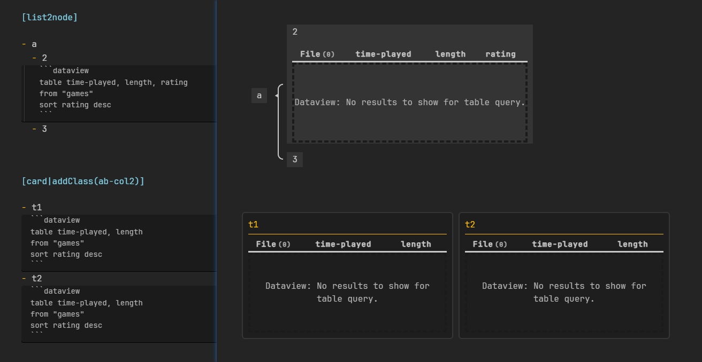
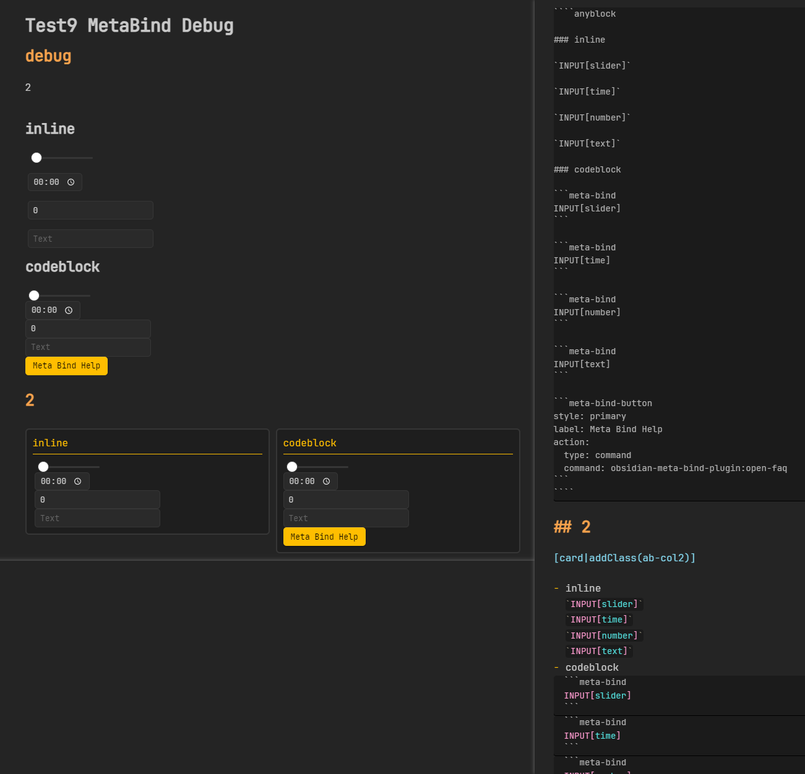
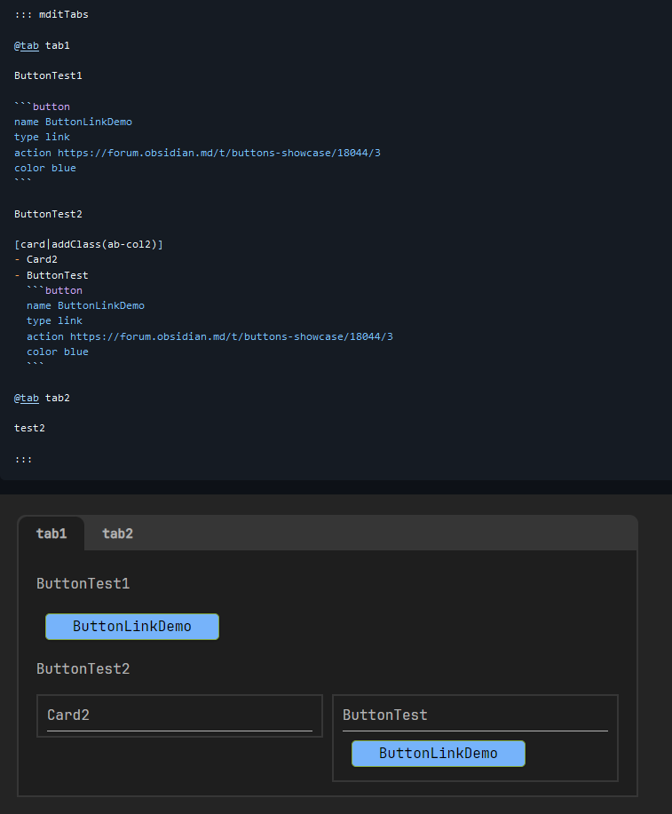
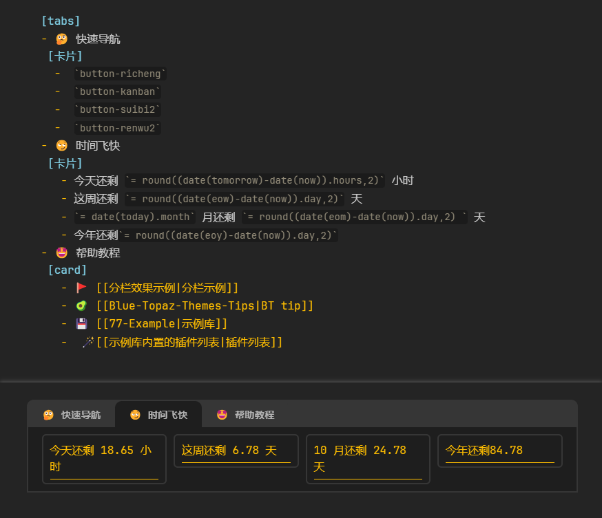
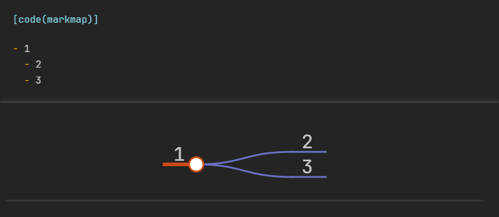
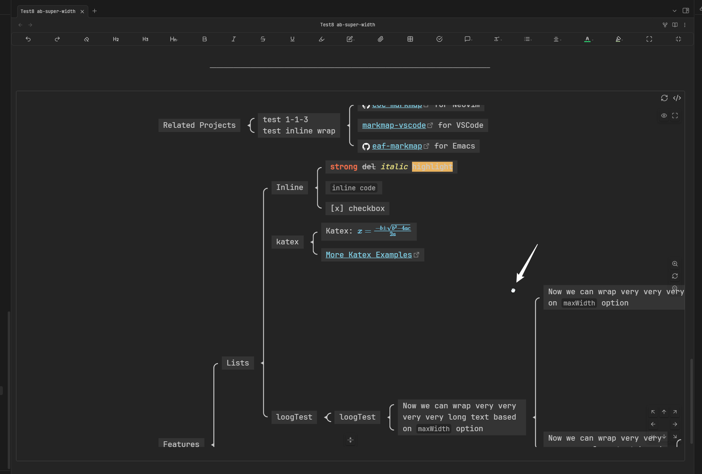

# 精彩用例

## 配合其他插件

用法大概有以下三大类：

### ab块内部包含其他插件

#### DataView



#### Meta-Bind (V3.1.7+才支持，感谢 Meta-Bind 作者的帮助)



#### Buttons

与 Buttons 插件进行配合。不过该插件已经不再维护，目前代替之的是 Meta-Bind 插件



#### Dataview的内联js (dataview inline dvjs) (V3.1.7+才支持)



### ab块负责选择范围，其他插件渲染范围里的东西

#### Mindmap-Nexgen

这个案例中，anyblock负责选择范围，mindmap nexgen负责渲染  

（In this case, anyblock is responsible for selecting the scope and mindmap nexgen is responsible for rendering）



#### NodeFlow

NodeFlow 也是与 AnyBlock 同一作者开发的，里面也支持列表语法。所以可以很方便地用 AnyBlock 选择一个列表，交由给 NodeFlow 的 `nodeflow-list` 或 `nodeflow-listitem` 代码块，进行渲染


#### ChatViewQQ

需要安装 obsidian-chat-view-qq 插件

例如：

````md
:::code(chat)
me:
This it is a question

chatGPT:
There are some answer

## Title1

some **content1**

## Title2

some **content2**
:::
````

#### Mehrmaid

需要安装 mehrmaid 插件

AB负责选择范围外还负责部分转换，然后再给Mehrmaid

例如：

````md
[list2mehrmaidText|code(mehrmaid)]

- 1**1**
    - 2*1*
    - $3+1$

或者使用别名版本简化：

[mehrmaid]

- 1**1**
    - 2*1*
    - $3+1$
````

### 被其他插件渲染ab块

#### Callout语法

anyblock嵌套callout正常，callout嵌套anyblock在阅读模式下暂不正常

#### Dataviewjs 渲染 anyblock 块

作者：ob论坛：[chris132](https://forum-zh.obsidian.md/u/chris132)[Chris Martin](https://forum-zh.obsidian.md/u/chris132)

一个简单测试的demo：

````md
```dataviewjs
const abcontent = `[list2table]

- 1
  - 2
  - 3`
dv.paragraph(abcontent)
dv.paragraph(abcontent)
```
````

如果不行可以换用更稳定的写法：

````md
```dataviewjs
const abcontent = `\`\`\`anyblock
[list2table]

- 1
  - 2
  - 3`
dv.paragraph(abcontent)
dv.paragraph(abcontent)
\`\`\`
```
````

可以配合dv检索进一步使用：

````md
```dataviewjs
const term = "[list2tab]";
let folderpath = "01"; // 更改为限定文件夹即可，留空为遍历所有笔记
const files = app.vault.getMarkdownFiles().filter(file => file.path.includes(folderpath));
const arr = files.map(async (file) => {
    const content = await app.vault.cachedRead(file);
    const lines = content.split("\n");
    let results = [];
    lines.forEach((line, index) => {
        if (line.includes(term)) {
            let section = [line];
            for (let i = index + 1; i < lines.length; i++) {
                if (lines[i].trim() === "") break;
                section.push(lines[i]);
            }
            results.push(section.join("\n"));
        }
    });
    return results;
});
Promise.all(arr).then(values => {
    values.flat().forEach(value => dv.paragraph(value)); // 使用 dv.paragraph 输出原始文本
});
```
````

再举一个例子

````md
```dataviewjs
const list = dv.markdownList(dv.pages('"01-论文"').file.link);
const dhow = '```anyblock\n[card]\n\n' + list + '\n```'
```
````

### 其他

#### Diagram-Zomm-Drag 拖拽支持

可以配合DiagramZommDrag实现渲染结果的缩放与拖拽

（这里的处理器是nodes加超级样式ab-super-width）



## 其他妙用

### 假如Obsidian不支持Callout语法，如何自行开发

略，自行想象

### 代码块内的反链

这个用法是用户开发出来的……并不是我一开始预设的行为：

[https://forum-zh.obsidian.md/t/topic/39261](https://forum-zh.obsidian.md/t/topic/39261)

有点 “歪门邪道”，虽然我个人不建议这样用，这里只是举例用于展示插件的灵活性

## 有待优化

兼容性问题：挺少的

- 表格类插件可能有一点影响
- callout包含anyblock在阅读模式下存在问题


